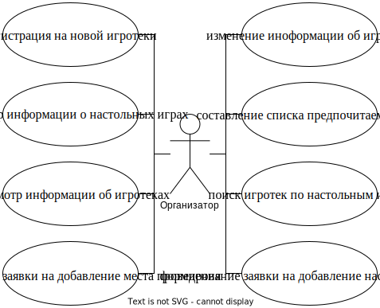

# ИгроМир

## Идея проекта

Создание информационной системы с возможностью просмотра и поиска информации о
настольных играх и игротеках для всех пользователей, возможностью составления
списка понравившихся игр, поиска игротек по нему и регистрации на игротеки —
для игроков, возможностью анонсирования игротек и открытия регистрации на них
— для организаторов.

## Предметная область

Предметной областью является реализация проведения многочисленных игротек.
Организатор выбирает название, дату, время и место проведения игротеки,
указывает настольные игры, по которым она проводится, предоставляет средства для
регистрации или указывает, что вход на игротеку свободный, и выкладывает анонс.
Игрок находит интересующие его настольные игры, характеризующиеся названием,
производителем, годом выпуска, количеством и возрастом игроков,
продолжительностью. По выбранным играм и другим характеристикам ищет необходимую
игротеку и регистрируется на нее.

## Аналогичные решения

На российском рынке программные решения в сфере настольных игр
представлены интернет-магазинами крупных продавцов: Hobby Games,
«Мосигра», «Низа Гамс» и др.

На зарубежном рынке преобладают тематические сайты: BoardGameGeek, Board Game
Arena и др.

Сравним существующие решения по следующим критериям:

1. Наличие информации о настольных играх
2. Наличие информации об игротеках
3. Наличие информации об игротеках различных организаторов
4. Возможность регистрации на игротеку
5. Ведение рейтингов игроков
6. Направленность на русскоязычную аудиторию

Результат сравнения представлен в виде таблицы:

|Решение|1|2|3|4|5|6|
|-------|-|-|-|-|-|-|
|Hobby Games|+|+|-|-/+|-|+|
|Мосигра|+|-|-|-|-|+|
|Низа Гамс|+|+|-|-/+|-|+|
|BoardGameGeek|+|+|+|+/-|-|-|
|Board Game Arena`*`|+|-|-|-|+|+|

`-/+` — через сторонний ресурс.

`+/-` — через отдельный раздел сайта с собственной регистрацией.

`*` — только для настольных игр, электронная версия которых реализована.

## Целесообразность и актуальность

В отличие от других рынков прямая реклама настольных игр работает не эффективно.
При этом наилучший способ прорекламировать игру — посадить человека играть.
Поэтому в сфере настольных игры приобрели популярность игротеки — мероприятия,
на котором гости могут поиграть в различные игры, завести знакомства, опробовать
новинки или ознакомиться с ассортиментом. Однако, как видно из сравнения
существующих решений, поиск игроками информации об игротеках, а также
регистрация на них проблематичны в силу отсутствия реализации необходимых
функциональностей.

## Use-Case диаграмма

## ER-диаграмма сущностей

## Архитектурные характеристики
